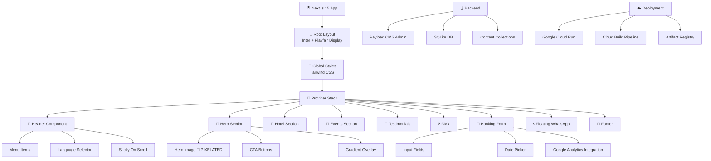
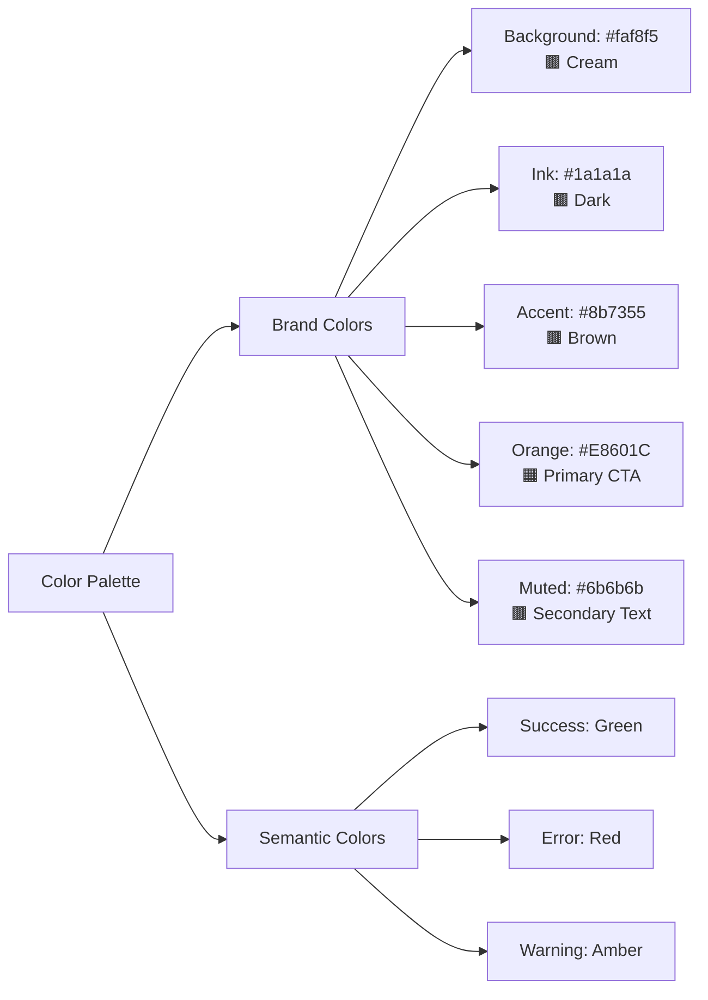
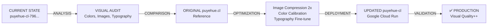
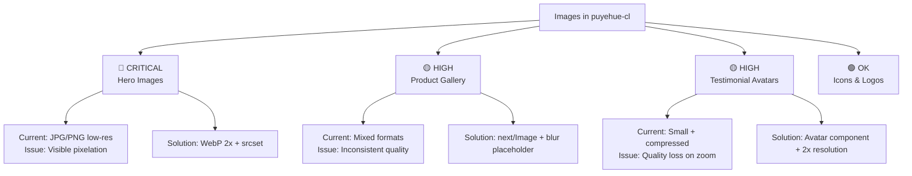

# 🏗️ PUYEHUE-CL: ARCHITECTURE DIAGRAM

## Component Hierarchy

## Color System

## Improvement Flow

## Image Optimization Priority

## Tech Stack Details

### Frontend
- **Framework:** Next.js 15.4.11 (latest)
- **Language:** TypeScript 5.5.4
- **Styling:** Tailwind CSS 3.4.7
- **Fonts:** Inter (sans) + Playfair Display (serif) from Google Fonts
- **Image Optimization:** next/image (needs improvement)
- **Testing:** Playwright 1.59.1

### Backend & CMS
- **CMS:** Payload 3.83.0 (headless)
- **Database:** SQLite with better-sqlite3
- **Admin UI:** Payload UI 3.83.0

### DevOps
- **Container:** Docker (Node 20 Alpine)
- **Orchestration:** Google Cloud Run
- **CI/CD:** Cloud Build + GitHub webhooks
- **Registry:** Google Artifact Registry

---

*Last Updated: 2026-05-06*
